Final Reality
=============

This work is licensed under a 
[Creative Commons Attribution 4.0 International License](http://creativecommons.org/licenses/by/4.0/)

Context
-------

This project's goal is to create a (simplified) clone of _Final Fantasy_'s combat, a game developed
by [_Square Enix_](https://www.square-enix.com)
Broadly speaking for the combat the player has a group of characters to control and a group of 
enemies controlled by the computer.

---
## Characters
All the characters have a name, life and defense. The enemies have damage points and weight. The
player's characters have a weapon with a given weight and damage points.  

Because they have certain behaviors in common, there is an interface with these common methods and
an abstract class (*AbstractCharacter*) that implements one of them. Because enemies and player characters have different
way to measure how long they wait in the queue, waitTurn is left as an abstract method.
Enemies are implemented with the *Enemy* class, which inherits from the *AbstractCharacter* class. It has the weight of the enemy and also
implements waitTurn based on this.  

The player's characters have a common interface (*IPlayerCharacter*), which has the common methods *equip* and *getEquippedWeapon*.  

*AbstractPlayerCharacter* extends *AbstractCharacter* and implements the *IPlayerCharacter* interface. Because all the player's characters
have a weapon, it has this field. It also implements *waitTurn* and *getEquippedWeapon*, which are common for all the player's characters,
based on the character's equipped weapon.  

Since different character classes will implement the *equip* method differently, this is left in each class. Also, because there are several classes, it is better to leave them apart. 
This also facilitates the implementation of the method *getEquals*, and the differentiation between different character classes.  

According to the implementation of the *attack* method, there is friendly fire, but the controller makes sure that it 
does not exist by having methods to attack *player character to enemy* and *enemy to player character*.

## Weapons

You have an interface that contains the common methods. AbstractWeapon implements the common methods for all
the types of weapons. Since there are several types, it was decided to leave them in separate classes, in addition to the fact that some have magic damage and others
no (this is not implemented at the moment). This also facilitates the implementation of the method *getEquals* and the differentiation between different types.

The weapons can be equipped depending on the character's type, given by the next table:

|    Type    | Sword | Axe | Knife | Staff | Bow |
|:----------:|:-----:|:---:|:-----:|:-----:|:---:|
|   Knight   |  Yes  | Yes |  Yes  |   No  |  No |
|  Engineer  |   No  | Yes |   No  |   No  | Yes |
|    Thief   |  Yes  |  No |   No  |  Yes  | Yes |
| Black Mage |   No  |  No |  Yes  |  Yes  |  No |
| White Mage |   No  |  No |   No  |  Yes  |  No |

## Controller
The controller has the list of player's characters, enemies, inventory, and the queue. It has
methods for the creation of all the types of characters and weapons, methods for getting their
information, and it performs the equipping and attacking. Also, it can know when a character dies and if
the user loses or wins. This is implemented with an observer. The character notifies the controller
of its death and the damage received when is attacked.  

In addition, the controller has methods to create weapons with random parameters.
The parameters are given by the following table:

|               | Sword |  Axe  | Knife | Staff |  Bow  |
|:-------------:|:-----:|:-----:|:-----:|:-----:|:-----:|
| Attack Points | 10-16 | 12-19 |  8-14 | 15-19 | 12-16 |
|     Weight    | 25-34 | 25-29 | 15-24 | 30-34 | 20-29 |

## Turns And Phases
You start by waiting for the queue to contain some character.
When the arrival of one of them is notified, the turn starts and the other
characters that are added to the queue simply stay there. It is checked if
the first character in the queue belongs to the enemies or to the player.
In the first case, it is automatically chosen some character to attack and
at the moment of doing it, the turn ends. If the first character of the queue
belongs to the player, you can choose between attacking an enemy or choosing
to change the weapon of the character in game. If you choose the first option,
when you choose who to attack you end your turn. At this point it can happen
that the queue is empty, so you will go to the waiting phase and start all
over again. If there is someone in the queue, the turn starts. Also, given
the attack made, a character may have died. If all the player's characters
have died, the game ends in defeat. If all the enemy's characters die,
the game ends in victory. Thus, you have the following phase diagram:

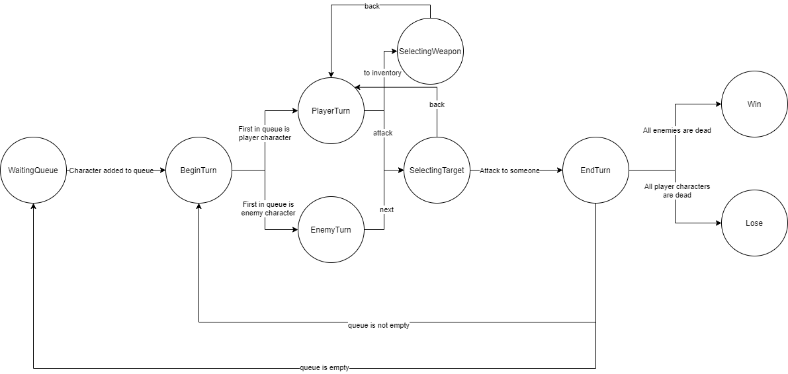

# How To Play

The resolution of the game window is width=512 and height=480.

### Initial Scene

When you open the game, the first thing you find is what is shown in the image below, where you can
configure the characters of your team and the amount of enemies.

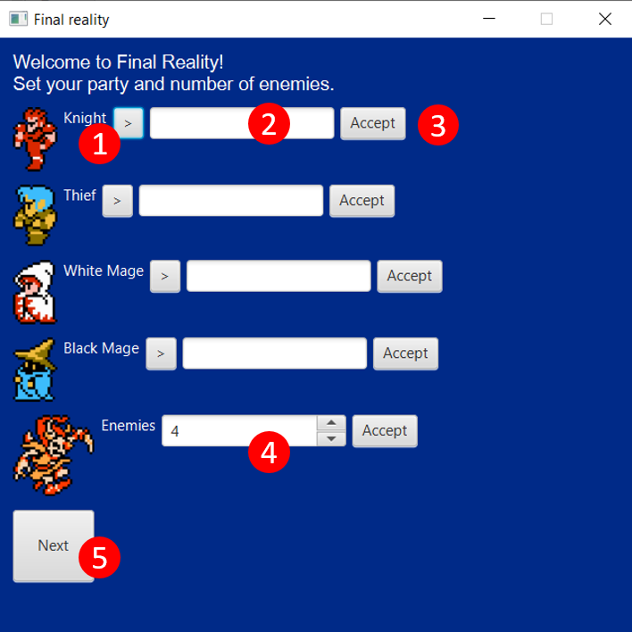

1. With the button ">" you can change the character class of your team.

2. In this Text Field you can give a name to your character.

3. When you have set the class and name, press accept.

4. When you have finished setting up all the fields, press "Next", which will take you to the next view.

The names of the characters cannot be repeated. If this happens, when you press "Accept", a message will appear at the
bottom informing you of this problem, as shown in "1" in the following figure

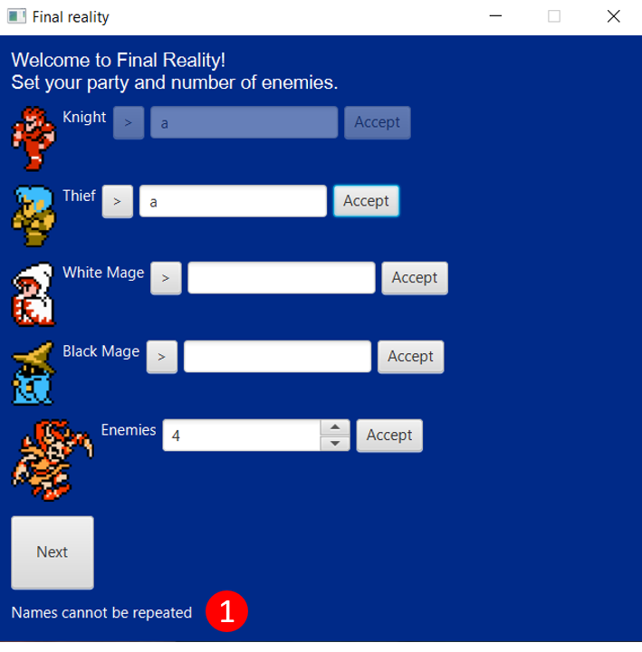

Also, if you have not finished setting up the game, pressing "Next" will inform you that you have to finish
setting up all the fields.

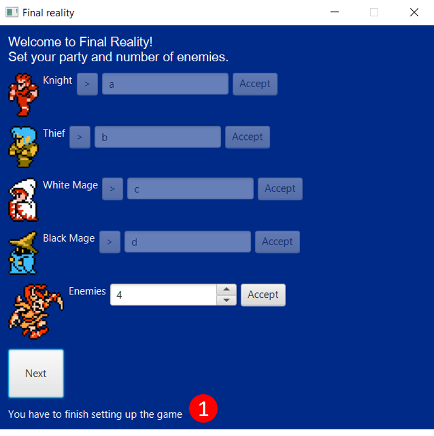

This view will create the player and enemy characters with the following random
parameters:

Life: Between 50 and 69.  

|            | Defense |
|:----------:|:-------:|
|   Knight   |   5-6   |
|    Thief   |   2-4   |
|  Engineer  |   2-6   |
| White Mage |   1-4   |
| Black Mage |   1-4   |
|    Enemy   |   1-6   |

Weight enemies: Between 15-24  
Attack points enemies: between 8-19

### Battle Scene
When you finish setting up the game and press the "Next" button,
you will reach the following view:

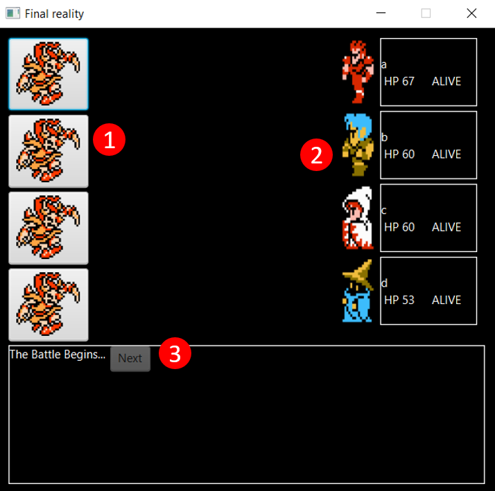

1. The buttons to attack the enemies are shown.

2. The information of the player's characters is shown.

3. In the lower box the relevant information of the turn is shown. At first, a disabled button is shown,
which is enabled once the first character enters the queue.  

In the case of a player's turn, the following is shown:

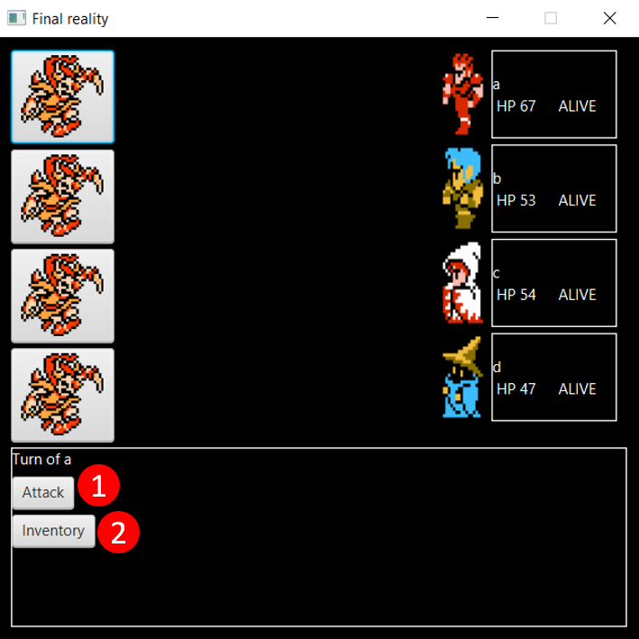

1. The player can choose to attack an enemy. Once this is done, you will have to press on an enemy to attack it.

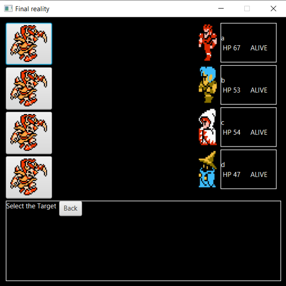

2.The player can choose to change weapons.

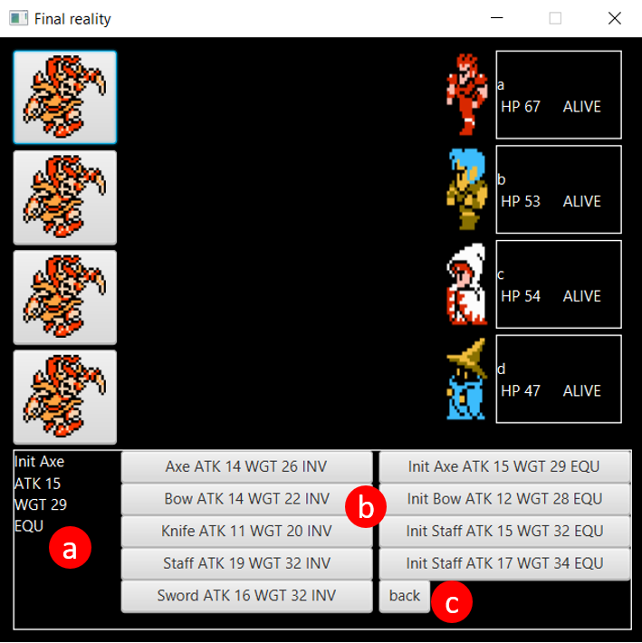

a. The weapon that the character has equipped at this time is shown.

b. All the weapons the player has are shown. Some are equipped (EQU) and others are in inventory (INV). In addition, each weapon shows its attack points (ATK) and weight (WGT).

c. "Back" button to exit the weapons equipment.

If the enemy runs out of characters, a message is displayed that the player has won:

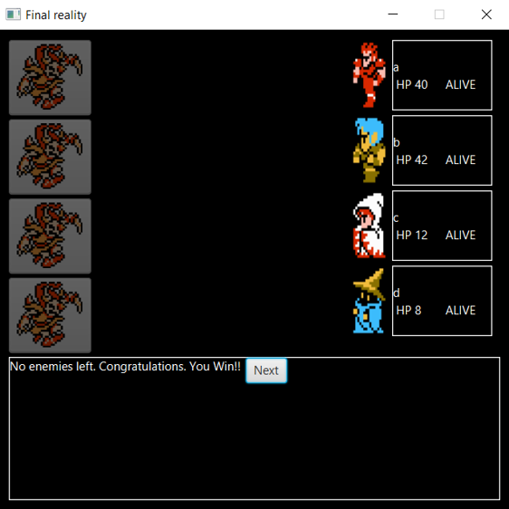

If the player runs out of characters, a message is displayed that the player has lost:

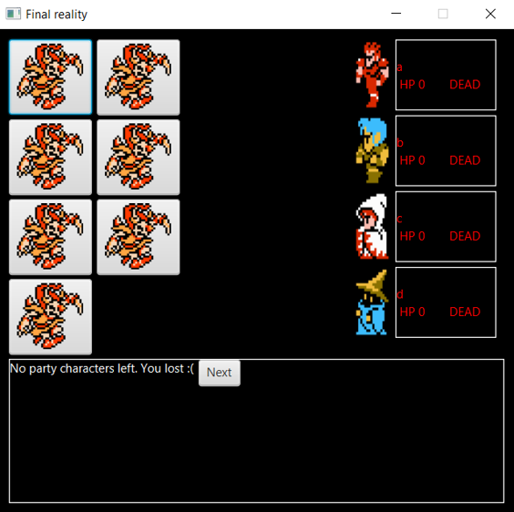

In either case, pressing "Next" takes you to a new view.

### Game Over

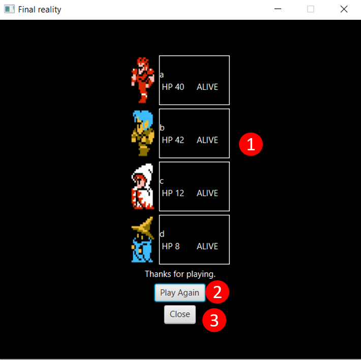

1. The final status information of the player's characters is displayed.

2. Button to play again, starting from the game settings.

3. Button to close the window and end the game.

